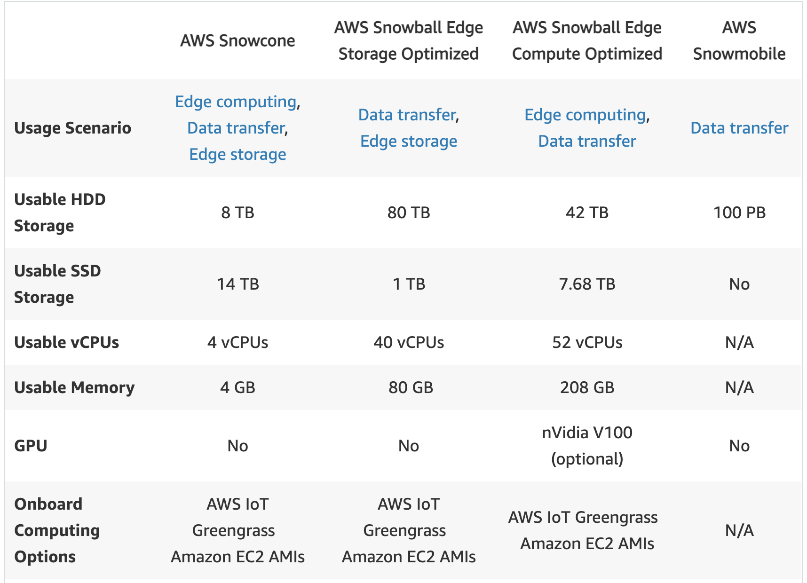

### S3
- an object storage service, not a network file system
- strong read-after-write consistency
- Object Lock can help prevent objects from being deleted or overwritten for a fixed amount of time or indefinitely.
- prefix
    - Amazon S3 automatically scales to high request rates.
    - Your application can achieve at least 3,500 PUT/COPY/POST/DELETE or 5,500 GET/HEAD requests per second per prefix in a bucket.
    - There are no limits to the number of prefixes in a bucket.
- S3 Transfer Acceleration (S3TA)
    - you pay only for transfers that are accelerated.
    - There are no S3 data transfer charges when data is transferred in from the internet.
    - takes advantage of Amazon CloudFront’s globally distributed edge locations.
    - if > 1G, prefer this than cloudfront
- cloudfront
    - By design, delivering data out of CloudFront can be more cost-effective than delivering it from S3 directly to your users.
    - georestriction
    - select this, if not upload, but download
    - each file automatically expires after 24 hours
    - support route to multiple origins based on the content type
    - Use an origin group with primary and secondary origins to configure CloudFront for high availability and failover
    - field-level encryption
        - public key to use to encrypt them
        - You can encrypt up to 10 data fields in a request. 
        - You can’t encrypt all of the data in a request with field-level encryption; you must specify individual fields to encrypt
- version
    - Once you version-enable a bucket, it can never return to an unversioned state. 
    - recover objects from accidental deletion or overwrite, delete marker
    - MFA delete
- Multipart upload, independently, no order, retry, 100 MB

- types
    - Standard, no The minimum storage duration charge, and the other types at least 30days, no retrive fee
        - pay for used,  the pricing is $0.023 per GB per month. 
    - Standard-Infrequent Access (S3 Standard-IA),  costs more than S3 One Zone-IA, less availability
    - Intelligent-Tiering, automatic moving objects between four access tiers when access patterns change, cost savings, no retrive fee
        - two low latency access tiers optimized for frequent and infrequent access, 
        - and two optional archive access tiers designed for asynchronous access that are optimized for rare access.
        - Frequent Access tier -> 30 days, Infrequent Access tier -> 90 days, (if activated) Archive Access tier -> 180 days, Deep Archive Access tier
    - One Zone-Infrequent Access (S3 One Zone-IA), Infrequent but requires rapid access when needed. costs 20% less than S3 Standard-IA
        - the minimum storage duration is 30 days before you can transition objects from S3 Standard to S3 One Zone-IA or S3 Standard-IA
    - S3 Glacier, for data archiving, cheap, can upload objects directly or use lifecycle, Configurable retrieval times, from minutes to hours, lifecycle supports 1 day
    - S3 Glacier Deep Archive, lowest cost, Retrieval time within 12 hours
    - lifecycle type: Transition & Expiration
- retention
    - You can place a retention period on an object version either explicitly or through a bucket default setting. 
    - When you use bucket default settings, you don't specify a Retain Until Date. Instead, you specify a duration, in either days or years
    - Different versions of a single object can have different retention modes and periods.
- aws S3 sync command
- Each uploaded file automatically gets a public URL, which can be used to download the file at a later 
- use Pre-Signed URLs to upload objects to S3
- By default, CloudTrail event log files are encrypted using Amazon S3 server-side encryption (SSE)
- Updates made to objects in S3 follow an eventual consistency model. Hence, for object updates made to the same key, there can be a slight delay for get new version
- If you create an S3 Lifecycle expiration rule that causes objects that have been in S3 Standard-IA or S3 One Zone-IA storage for less than 30 days to expire, you are charged for 30 days. If you create a Lifecycle expiration rule that causes objects that have been in S3 Glacier storage for less than 90 days to expire, you are charged for 90 days. 
- origin access identity (OAI)
    - Create a special CloudFront user called an origin access identity (OAI) and associate it with your distribution.
    - Configure your S3 bucket permissions so that CloudFront can use the OAI to access the files in your bucket and serve them to your users. Make sure that users can’t use a direct URL to the S3 bucket to access a file there.
    - S3 buckets don't have security groups
- Retrieving S3 Glacier Archives
    - Expedited 加快
    - Standard
    - bulk
- Cross region replication
    - can not replicate existed data
    - can across region, S3 sync command also can
- Amazon S3 notification
    - first add a notification configuration that identifies the events you want Amazon S3 to publish
    - destinations:
        - Amazon Simple Notification Service (Amazon SNS) topic
        - Amazon Simple Queue Service (Amazon SQS) queue, FIFO not supported
        - AWS Lambda
- static website url:
    - s3-website dot (.) Region : http://bucket-name.s3-website.Region.amazonaws.com
    - s3-website dash (-) Region : http://bucket-name.s3-website-Region.amazonaws.com
- An object consists of the following:
    - key, version id, value, subresource, access control info, metadata
    - Metadata, which can be included with the object, is not encrypted while being stored on Amazon S3. Therefore, AWS recommends that customers not place sensitive information in Amazon S3 metadata.
- Glacier
    - S3 Glacier vault is a container for storing archives. When you create a vault, you specify a vault name and the AWS Region in which you want to create the vault. 
    - S3 Glacier Vault Lock allows you to easily deploy and enforce compliance controls for individual S3 Glacier vaults with a vault lock policy
### Gateway
- restful api vs. websocket
    - RESTful APIs, HTTP-based, stateless
    - websocket, stateful, full-duplex, route based on message content
- Amazon API Gateway
    - throttles requests to your API using the token bucket algorithm
- Amazon Gateway Endpoint, specify as a target for a route in your route table for traffic destined

### route 53
- DNS
- route policy
    - simple
    - failover
    - geolocation
    - geoproximity
    - latency
        - Use latency based routing when you have resources in multiple AWS Regions and you want to route traffic to the region that provides the lowest latency
    - weighted
    - multivalue answer: If you want to route traffic approximately randomly to multiple resources
- DNS cache
- rules
    - CNAME record, charged
        - an alias record can only redirect queries to selected AWS resources such as S3 buckets, CloudFront distributions, and another record in the same Route 53 hosted zone; however a CNAME record can redirect DNS queries to any DNS record
        - cannot create a CNAME record for the top node of a DNS namespace, also known as the zone apex. For example, if you register the DNS name example.com, the zone apex is example.com. You cannot create a CNAME record for example.com, but you can create CNAME records for www.example.com
    - Alias record, no charge, 
        - can create an alias record at the top node of a DNS namespace, also known as the zone apex, however, you cannot create a CNAME record for the top node of the DNS namespace,
        - can be used to non domain cases, such as CloudFront distribution
    - MX record, specifies the names of your mail servers
    - NS record, identifies the name servers for the hosted zones
    - A record - Used to point a domain or subdomain to an IP address.
    - PTR record - A Pointer (PTR) record resolves an IP address to a fully-qualified domain name (FQDN) as an opposite to what A record does
- on-promise
    - Create an inbound endpoint on Route 53 Resolver and then DNS resolvers on the on-premises network can forward DNS queries to Route 53 Resolver via this endpoint
    - Create an outbound endpoint on Route 53 Resolver and then Route 53 Resolver can conditionally forward queries to resolvers on the on-premises network via this endpoint
- hosted zone
    - Public Hosted Zone - contain records that specify how you want to route traffic on the internet. 
    - Private Hosted Zone - contain records that specify how you want to route traffic in an Amazon VPC. 
    - When you register a domain with Route 53, we create a hosted zone for you automatically.


### Load Balancer
- Application Load Balancer
    - target type: Instance, private IP or a Lambda function
- Network Load Balancer
    - operates at the connection level (Layer 4), routing connections to targets - Amazon EC2 instances, microservices, and containers – within Amazon Virtual Private Cloud (Amazon VPC) based on IP protocol data
- Classic Load Balancer 
    - provides basic load balancing across multiple Amazon EC2 instances
- Deregistration, 
    - By default, 300 seconds
- cross-zone load balancing, az as min unit -> instance as min unit
    - default: Application Load Balancer is enabled
    - default: Network Load Balancer is disabled
    - Classic Load Balancer, by cli: disabled, by consle: enabled
- Elastic Load Balancing logs 
    - time the request was received, the client's IP address,latencies, request paths, and server responses. 
- ELB can only balance traffic in one region and not across multiple regions.
### Network
- types
    - AWS Direct Connect, establish a dedicated network connection from your premises to AWS. expensive, and takes a few days to a few months to setup
        - does not support encrypted network connectivity
    - AWS Direct Connect plus VPN, combine one or more AWS Direct Connect with the Amazon VPC VPN. This combination provides an IPsec-encrypted, reduces network costs, increases bandwidth throughput, and provides a more consistent network.
    - AWS Site-to-Site VPN, securely connect your on-premises network or branch office site to your VPC. 
        - IPsec VPN connection
        - a Virtual Private Gateway on the AWS side 
        - a Customer Gateway on the on-premises side
    - VPC transit gateway, a network transit hub that you can use to interconnect your VPC. transient（瞬态）， transit（运输）
        -  acts as a hub
    - VPC peering, 一对一，没有传递性
    - AWS PrivateLink, establishes private connectivity between virtual private clouds (VPC) and services hosted on AWS or on-premises
    - VPC endpoint，enables you to privately connect your VPC to supported AWS services and VPC endpoint services powered by AWS PrivateLink without requiring an internet gateway, NAT device, VPN connection, or AWS Direct Connect connection.
        - Interface: provisions an ENI (private IP address) as an entry point (must attach security group) – most AWS services
        - Gateway: provisions a target and must be used in a route table – S3 and DynamoDB
    - VPC sharing
        - allows multiple AWS accounts 
        - shares subnets
        - centrally-managed
    - VPN CloudHub
        - operates on a simple hub-and-spoke model that you can use with or without a VPC
        - suitable if you have multiple branch offices and existing internet connections 
        - AWS Site-to-Site VPN and AWS Direct Connect can be invloved
    - VPC security groups, to control the network traffic to and from your file system
- transfer speed
    - AWS Global Accelerator, improve the performance, a good fit for non-HTTP use cases, 
    also supported
        - bule/green 
        - 聚合, Network Load Balancers, Application Load Balancers, Elastic IPs, and EC2 Instances, without making user-facing changes
        - giving you a single entry point to your application, regardless of how many AWS Regions it’s deployed in
    - Amazon CloudFront, CDN(content delivery network)
    - diff: AWS Global Accelerator & CloudFront both use the AWS global network and its edge locations around the world. CloudFront improves performance for both cacheable content and dynamic content (such as API acceleration and dynamic site delivery), while Global Accelerator improves performance for a wide range of applications over TCP or UDP. 
- VPC console wizard
    - VPC with a single public subnet, run a single-tier, public-facing web application, such as a blog or a simple website.
    - VPC with public and private subnets (NAT), run a public-facing web application while maintaining back-end servers that aren't publicly accessible(database)
    - VPC with public and private subnets and AWS Site-to-Site VPN access, run a multi-tiered application with a scalable web front end in a public subnet and **to house your data in a private subnet**
    - VPC with a private subnet only and AWS Site-to-Site VPN access, There is no Internet gateway to enable communication over the Internet
    - Wrong: VPC with a public subnet only and AWS Site-to-Site VPN access
-  NAT instance or a NAT Gateway
    - NAT instance can be used as a bastion server
    - Security Groups can be associated with a NAT instance
    - NAT instance supports port forwarding
    - NAT gateway, you are charged for each hour that your NAT gateway is available and each Gigabyte of data that it processes
    - NAT instance, charged as EC2 instance
    - both not support ipv6
    - both could used for downloading from internet
    - If you have resources in multiple Availability Zones and they share one NAT Gateway, but if the NAT Gateway’s Availability Zone is down, resources in the other Availability Zones lose internet access
- Internet Gateway, cannot be used directly with a private subnet
- Egress-only internet gateway, an Internet Gateway that supports IPv6 traffic
- AWS Resource Access Manager (RAM)
    - no additional charge. 
    - a service that enables you to easily and securely share AWS resources with any AWS account or within your AWS Organization. 
    - You can share AWS Transit Gateways, Subnets, AWS License Manager configurations, and Amazon Route 53 Resolver rules resources with RAM.
    - You can create resources centrally in a multi-account environment, and use RAM to share those resources across accounts in three simple steps: 
        - create a Resource Share
        - specify resources
        - specify accounts. 
- To enable access to or from the internet for instances in a VPC subnet, you must do the following: 
    - Attach an internet gateway to your VPC. 
    - Ensure that your subnet's route table points to the internet gateway. 
    - Ensure that instances in your subnet have a globally unique IP address (public IPv4 address, Elastic IP address,or IPv6 address). 
    - Ensure that your network access control and security group rules allow the relevant traffic to flow to and from your instance
- route table
    - A subnet is implicitly associated with the main route table if it is not explicitly associated with a particular route table.
### Security groups
- By default, security groups allow all outbound traffic.
- Security group rules are always permissive; you can't create rules that deny access.
- Security Groups are stateful, so allowing inbound traffic to the necessary ports enables the connection. 
- Network ACLs are stateless, so you must allow both inbound and outbound traffic
- inbound rule: ipv4/6 address/block, another security group
- The default network ACL is configured to allow all traffic to flow in and out of the subnets to which it is associated

### Auto Scaling group
- policy
    - scheduled action
    - lifecycle hook
    - target tracking policy, choose a scaling metric and set a target value, ASG auto creates and manages the CloudWatch alarms
    - step scaling policy, step <-> threshold
    - simple scaling policies, like `step scaling policy`, but without step feature, 
        - Both require you to create CloudWatch alarms for the scaling policies. 
        - Both require you to specify the high and low thresholds for the alarms. 
        - Both require you to define whether to add or remove instances, and how many, or set the group to an exact size.
        - In most cases, step scaling policies are a better choice than simple scaling policies, even if you have only a single scaling adjustment.
- standby state
    - Instances that are on standby are still part of the Auto Scaling group
- lifecycle hooks
    - perform custom actions
- launch configuration
    - an instance configuration template that an Auto Scaling group uses to launch EC2 instances
    - can't modify a launch configuration once it is created.
    - 过时的
- launch template
    - mix multiple instance types using both On-Demand Instances and Spot Instances
    - version
- Health check
    - grace period
    - Impaired status(削弱), ASG waits a few minutes for the instance to recover.
    - insufficient data, ASG might also delay or not terminate
    - custom health checks, when unhealthy, ASG will terminate
- default termination policy
    - on-demand/spot instance -> old launch config -> old launch template -> close to next billing
- if more than one policy matched, the policy that provides the largest capacity will be selected
- Not support: add the software installation to the configuration
- Cooldown period is a configurable setting for your Auto Scaling group which ensures that it doesn't launch or terminate additional instances before the previous scaling activity takes effect.
- delete the ASG, the instances will be terminated and the ASG will be deleted
- regional constructs. They can span Availability Zones, but not AWS regions.
- support combined purchasing model
- minimum, maximum, and desired capacity(default: = minimum)
### AMI, snapshot
- When the new AMI is copied from region A into region B, it automatically creates a snapshot in region B because AMIs are based on the underlying snapshots. 
- region based
- Golden AMI 
    - an AMI that you standardize through configuration, consistent security patching, and hardening. It also contains agents you approve for logging, security, performance monitoring
    - Golden AMI pipeline

### Stortage
- Amazon FSx
    - Amazon FSx for Windows File Server, provides fully managed, highly reliable file storage that is accessible over the industry-standard Service Message Block (SMB) protocol. It is built on Windows Server
    - Amazon FSx for Lustre, makes it easy and cost-effective to launch and run the world’s most popular high-performance file system
        - integrates with Amazon S3
- Instance store
    - provides temporary block-level storage for your instance
    - You can specify instance store volumes for an instance only when you launch it. 
    - You can't detach an instance store volume from one instance and attach it to a different instance.
    - The data in an instance store persists only during the lifetime of its associated instance. I
    - data persist: reboot, lost: stop, terminate, hibernate
    - provide high random I/O performance at low cost
    - cheaper than gp2 and io1
- EBS
    - EBS volumes behave like raw, unformatted block devices. 
    - You can mount these volumes as devices on your instances. 
    - EBS volumes that are attached to an instance are exposed as storage volumes that persist independently from the life of the instance.
    - Multi-Attach: a single Provisioned IOPS SSD (io1 or io2) volume to multiple instances(up to 16 Linux instances built on the Nitro System) that are in the same Availability Zone. 
    - $0.10 per GB-month of provisioned storage. 
    - encrypted everywhere, such as snapshot create, ec2 read data,...
    - az locked
    - it is automatically replicated within its Availability Zone to prevent data loss 
    - raid
        - raid 0: for greater I/O performance than you can achieve with a single volume, RAID 0 can stripe multiple volumes together; 
        - raid 1: for on-instance redundancy, RAID 1 can mirror two volumes together.

- EFS
    - regional, across multiple az
    - pay only for the resources that you use. The EFS Standard Storage pricing is $0.30 per GB per month. 
- Snowball Edge Storage Optimized
    - 80 TB of usable HDD storage, 40 vCPUs, 1 TB of SATA SSD storage, and up to 40 Gb network connectivity
    - original Snowball device had 80TB of storage space.
    - You can't directly copy data from Snowball Edge devices into AWS Glacier.
    
- AWS Storage Gateway, cache, on premises access to virtually unlimited cloud storage
    - File Gateway, s3, offers Server Message Block (SMB) or NFS-based access to data in Amazon S3 with local caching. 
    - volume gw, cloud-based iSCSI block storage volumes, iSCSI block
        - Cached Volume - stores the full volume in its Amazon S3 service bucket, and just the recently accessed data is retained in the gateway’s local cache for low-latency access.
        - Stored Volumes, your entire data volume is available locally in the gateway, for fast read access, while also asynchronously getting backed up to Amazon S3
    - tape gw, moving tape backups to the cloud. not nfs interface
    - Supported: Create a lifecycle policy to immediately move data to Glacier Deep Archive
    - Types
        - Standard 
        - Standard–IA
        - One Zone
        - One Zone–IA 
    - Storage Gateway optimizes data transfer to AWS by sending only changed data and compressing data.
          

### Cache
- ElastiCache for redis
    - aws makes redisbe Health Insurance Portability and Accountability Act of 1996 (HIPAA)
    - Redis authentication tokens enable Redis to require a token (password) before allowing clients to execute commands
    - purpose-built commands for working with real-time geospatial data
- Multi-AZ, min data loss, cost
### DB
- DynamoDB 
    - a key-value, document database, multi-region, built-in security, backup and restore
    - DynamoDB Accelerator (DAX), a fully managed, highly available, in-memory cache, 10x performance
    - max item size 400kb
    - also can be used as session store, has open source libs
    - DynamoDB Streams on a table, you can associate the stream ARN with a Lambda function that you write. Immediately after an item in the table is modified, a new record appears in the table's stream. AWS Lambda polls the stream and invokes your Lambda function synchronously when it detects new stream records
    - All DynamoDB tables are encrypted
        - can't disabled
        - By default, encrypted under an AWS owned customer master key (CMK), which do not write to CloudTrail logs, don't charge
        - can set to use another customer-managed CMK
- Redshift
    - a fully-managed petabyte-scale, column-oriented, cloud-based data warehouse 
    - designed for large scale data set storage and analysis.
    - Redshift Spectrum(光谱), query and retrieve structured and semistructured data from files in Amazon S3 without having to load the data into Amazon Redshift tables.
    - When you provision an Amazon Redshift cluster, it is locked down by default so nobody has access to it, should config security group
    - Enable Amazon Redshift Enhanced VPC Routing to let all traffic from and to the Redshift cluster does not go through the Internet.
    - Regardless of whether you enable automated snapshots, you can take a manual snapshot whenever you want. Amazon Redshift will never automatically delete a manual snapshot.Manual snapshots are retained even after you delete your cluster
    - Automated snapshots are automatically deleted within the period of 1(Least) to 35(Max) days(Based on the retention period settings). 
    - Cross-Region Snapshots for the Redshift Cluster. 
- Elasticsearch
    - full-text search engine, with an HTTP web interface, schema-free JSON documents
- RDS (Relational Database Service)
    - makes it easy to set up, operate, and scale a relational database in the cloud.
    - Amazon RDS Multi-AZ, at least 2 az, non-aurora: synchronously replicates, aurora: asynchronous
        - availablity 
        - in single region
        - URL is the same, the failover is automated, by changing CNAME
        - RDS applies OS updates by performing maintenance on the standby, then promoting the standby to primary, and finally performing maintenance on the old primary, which becomes the new standby
    - Amazon RDS Read Replicas, use MySQL, MariaDB, PostgreSQL, Oracle, and SQL Server databae engines asynchronous replication
        - provide enhanced performance, scalability, and durability, not availablity, because maybe in one az
    - if master database is encrypted, read replicas are encrypted
    - You can only enable encryption for an Amazon RDS DB instance when you create it
        - can create a snapshot of your DB instance, and then create an encrypted copy of that snapshot
    - replicating data，no charge for same region
    - not fully managed
    - max 16tb
    - can't use autoscaling with RDS
    - virtual shards 
        - Sharding is a common concept to split data across multiple tables in a database
    - DB parameter groups
        - a container for engine configuration values that are applied to one or more DB instances. 
        - A default DB parameter group is created if you create a DB instance without specifying a customer-created DB parameter group. 
        - Each default DB parameter group contains database engine defaults and Amazon RDS system defaults based on the engine, compute class, and allocated storage of the instance. 
        - You cannot modify the parameter settings of a default DB parameter group; you must create your own DB parameter group to change parameter settings from their default value.
    - highly discourage disabling automated backups because it disables point-in-time recovery(0-35 days)
- Aurora
    - Amazon Aurora Global Database is designed for globally distributed applications, allowing a single Amazon Aurora database to span multiple AWS regions
    - Aurora Replica, readonly, up to 15 Aurora Replicas per cluster,
        - auto-scales up to 64TB per database instance, up to 15 low-latency read replicas, across 3 az, a priority tier (0-15), same priority -> largest in size
    - MySQL and PostgreSQL-compatible
    - Aurora multi-master DB cluster, all DB instances can perform write operations. There isn't any failover
    - five times faster than standard MySQL databases and three times faster than standard PostgreSQL databases
    - max 64 tb
- Amazon Aurora Serverless
    - on-demand, auto-scaling configuration for Amazon Aurora
    - auto managed
- Neptune
    - a fast, reliable, fully managed graph database service

- AWS Database Migration Service 
    - helps you migrate databases to AWS quickly and securely. 
    - replicate your data with high availability and consolidate databases into a petabyte-scale data warehouse by streaming data to Amazon Redshift and Amazon S3.
    - supports Amazon S3 as the source and Kinesis as the target
- AWS Schema Conversion Tool to convert the source schema and code to match that of the target database
- DocumentDB is a fast, scalable, highly available, and fully managed document database service that supports MongoDB workloads
    - no cache


### EC2 
- Placement groups
    - Cluster placement groups, within a single az, high-throughput
    - Partition placement groups, availablity, max 7 partitions per az, can be used to deploy large distributed and replicated workloads, such as HDFS, HBase, and Cassandra, across distinct racks. visibility: which instances are in which partitions. share information accross Partitions
    - Spread placement groups, can span multiple az in the same Region. You can have a maximum of 7 running instances per Availability Zone per group. suitable for mixing instance types or launching instances over time.
- volume types
    - IOPS cannot be directly increased on a gp2 volume without increasing its size
    - SSD-backed volumes, frequent read/write operations with small I/O size, IOPS(每秒的讀寫次數), 
        - General Purpose SSD — gp2/3, Provides a balance of price and performance. We recommend these volumes for most workloads. IOPS/Volume of 16,000. allows a burst in performance when needed.
        - Provisioned IOPS SSD — io1/io2/io2 Block Express ‡, Provides high performance for mission-critical, low-latency, or high-throughput workloads. io1/io2 maximum of 64,000 IOPS and provide up to 1,000 MB/s of throughput per volume. io2 Block Express ‡ has 4*64000=256000, and 4000mb/s
            - Multi-Attach
    - HDD-backed volumes, throughput (measured in MiB/s) is a better performance measure than IOPS. CANNOT be used as a boot volume
        - Throughput Optimized HDD, st1 — A low-cost HDD designed for frequently accessed, throughput-intensive workloads. max IOPS/Volume of 500
        - Cold HDD, sc1 — The lowest-cost HDD design for less frequently accessed workloads. max IOPS/Volume of 250.
- Nitro System, a collection of AWS-built hardware and software components that enable high performance, high availability, and high security.
- security group
- user data 
    - executed as the root user
    - 2 types: shell scripts and cloud-init directives
    - into the launch wizard as plain text or as a file.
    - only during the boot cycle when you first launch an instance
- instance purching options
    - Spot Instance, an unused EC2 instance that is available for less than the On-Demand price, interrupted
        - spot request: includes the desired number of instances, the instance type, the Availability Zone, and the maximum price...
        - 2 types: one-time, persistent
        - if persistent, request is opened again when Amazon EC2 interrupts a Spot Instance or if you stop a Spot Instance
        - spot blocks: a duration during which instance are not interrupted, 1-6h, not supported after 2021/7/1
        - if spot request has associated running spot instance, canceling the request does not terminate the instance
    - On-Demand Instances, you pay for compute capacity by the second with no long-term commitments
    - Reserved Instances provide you with significant savings on your Amazon EC2 costs compared to On-Demand Instance pricing. Reserved Instances are not physical instances
    - Dedicated Host is a physical server with EC2 instance capacity fully dedicated to your use, license
    - Dedicated Instances,
        - run in a virtual private cloud (VPC) on hardware that's dedicated to a single customer. 
        - Dedicated Instances that belong to different AWS accounts are physically isolated at a hardware level, even if those accounts are linked to a single payer account.
        -  However, Dedicated Instances may share hardware with other instances from the same AWS account that are not Dedicated Instances.
        -  single-tenant hardware
        -  can convert between: dedicated instance <-> dedicated host, they both can't convert with default
    -  Spot Fleet
        - selects the Spot Instance pools that meet your needs and launches Spot Instances to meet the target capacity for the fleet.
-  hibernate an instance
-  Connection Draining(下水道)
    - enables the load balancer to complete in-flight requests made to instances that are de-registering or unhealthy. The maximum timeout value can be set between 1 and 3,600 seconds (the default is 300 seconds).
- Idle Timeout
- Launch Config Tenancy + VPC Tenancy: dedicated > default
- networking components
    - Elastic Network Interface (ENI) is a logical networking component in a VPC that represents a virtual network card. You can create a network interface, attach it to an instance, detach it from an instance, and attach it to another instance. The ENI is the simplest networking component 
    - Elastic Network Adapter (ENA) devices support enhanced networking via single root I/O virtualization (SR-IOV) to provide high-performance networking capabilities. 
    - Elastic IP address is a public static IPv4 address associated with your AWS account. which is reachable from the internet. It is not a networking device
    - Elastic Fabric Adapter (EFA) is a network device that you can attach to your Amazon EC2 instance to accelerate High Performance Computing (HPC) and machine learning applications
- Revover
    - A recovered instance is identical to the original instance, including the instance ID, private IP addresses, Elastic IP addresses, and all instance metadata
    - If your instance has a public IPv4 address, it retains the public IPv4 address after recovery
- You can easily add tags to define which instances are production and which ones are development instances. These tags can then be used while controlling access via an IAM Policy
- by default, EBS Volumes are replicated within their Availability Zones
- metadata
    - http://169.254.169.254/latest/meta-data/ 
- CloudWatch Logs agent installer on an existing EC2 instance to install and configure the CloudWatch Logs agent. After installation is complete, logs automatically flow from the instance to the log stream you create while installing the agent.
### KMS
- customer master key (CMK), enforces a waiting period. To delete a CMK in AWS KMS you schedule key deletion. You can set the waiting period from a minimum of 7 days up to a maximum of 30 days, default 30
- SSE-S3, server side encryption, each object is encrypted with a unique key. However without audit trail, self managed
- SSE-KMS, with trail, need you manage the master key in AWS KMS.
- SSE-C , you manage the encryption keys and Amazon S3 manages the encryption
- AWS CloudHSM Module
    - you can manage your own encryption keys using FIPS 140-2 Level
    - have complete control over the keys and the entire lifecycle around the keys
### Protect
- Amazon GuardDuty
    - continuously monitor and protect your AWS accounts, workloads, and data stored in Amazon S3. 
    - AWS CloudTrail Events, Amazon VPC Flow Logs, and DNS Logs. It also uses integrated threat intelligence such as known malicious IP addresses, anomaly detection, and machine learning to identify threats more accurately.
    - Disabling the service will delete all remaining data, including your findings and configurations
- Amazon Inspector, security assessments help you check for unintended network accessibility of your Amazon EC2 instances and for vulnerabilities on those EC2 instances
- AWS WAF is a web application firewall service, Geo match conditions
    - specifies the IP addresses that you want to allow through
    - AWS WAF is tightly integrated with Amazon CloudFront, the Application Load Balancer (ALB), Amazon API Gateway, and AWS AppSync
- macie, private data
- AWS Shield， ddos
- Service control policies (SCPs) 
    - can be used to manage your organization. SCPs offer central control over the maximum available permissions for all accounts in your organization, allowing you to ensure your accounts stay within your organization’s access control guidelines.
- AWS Trusted Advisor
    - provides recommendations that help you follow AWS best practices. Trusted Advisor evaluates your account by using checks. These checks identify ways to optimize your AWS infrastructure, improve security and performance, reduce costs, and monitor service quotas.
    - can be used for check service limit

### SQS
- fifo, 300/min, batch 3000, 10 requests max
    - .fifo suffix
    - GroupID，extend consumer, keep order in group
- can't convert an existing standard queue into a FIFO queue.
- Delay queues let you postpone the delivery of new messages to a queue for several seconds, invasible, 0-15min
- Visibility timeout is a period during which Amazon SQS prevents other consumers from receiving and processing a given message, default 30s, 0-12h
- short polling and long polling(投票)
    - short polling, default, SQS sends the response right away, even if the query found no messages
    - long polling, SQS sends a response after it collects at least one available message, up to the maximum number of messages specified in the request. Amazon SQS sends an empty response only if the polling wait time expires.
        - set 'receiveMessage'
        - save cost
- Delay and timer
    - delay applies to all messages
    - timer = one single delay when sending
- Amazon EventBridge
    - decouple the complex architecture - This event-based service is extremely useful for connecting non-AWS SaaS (Software as a Service) services to AWS services
- Use two SQS queues, one for high priority messages, the other of r default priority. Transformation instances first poll the high priority queue; if there is no message, they poll the default priority queue. 
### SNS
- pay only for the compute time that you consume
- FIFO, can only be subscribed by a SQS FIFO
    - deduplication either by enabling content-based deduplication on the topic, 
    - or by adding a deduplication ID to the messages that you publish
- Standard SNS -> Standard SQS
- FIFO SNS -> FIFO SQS
- Amazon EventBridge
    - support third-party services integration.

### Lambda
- Support: c#, go, java, node.js, python, ruby
- currently supports 1000 concurrent executions per AWS account per region
    - need to contact AWS support to raise the account limit.
- Lambda functions always operate from an AWS-owned VPC.
    -  You should only enable your functions for VPC access when you need to interact with a private resource located in a private subnet. An RDS instance is a good example.
    - Once your function is VPC-enabled, all network traffic from your function is subject to the routing rules of your VPC/Subnet. 
    - If your function needs to interact with a public resource, you will need a route through a NAT gateway in a public subnet.

### Access Control

- S3 Bucket Policies
    - centralized management of permissions.
    - Policies can be attached to users, groups, or Amazon S3 buckets
    - can grant users within your AWS Account or other AWS Accounts
    - further restrict based on certain conditions, such as request time, SSL， IP
    - resource-based policy, same account or other accounts
    - user policy, only control users in same account
- permissions boundary
    - can be used to control the maximum permissions employees can grant to the IAM principals, permissions boundary intersect with IAM permissions policy
- Service control policies (SCPs) 
    - available only in an organization that has all features enabled

### IAM
- IAM database authentication
    - You can authenticate to your DB instance using AWS Identity and Access Management (IAM) database authentication
    - works with MySQL and PostgreSQL
    - An authentication token is a unique string of characters generated using AWS Signature Version 4. 
    - Each token has a lifetime of 15 minutes.
- IAM role
    - manage temporary credentials for applications that run on an EC2 instance
- Lambda -> S3
    - On same AWS Account, just grant IAM role for Lambda
    - On different Account, IAM role for lambda & S3 bucket policy   
- s3:ListBucket is applied to buckets, so the ARN is in the form "Resource":"arn:aws:s3:::mybucket"
- allows running EC2 instances only in the eu-west-1 region, and the API call can be made from anywhere in the world
```
{
  "Version": "2012-10-17",
  "Statement": [
    {
      "Sid": "Mystery Policy",
      "Action": [
        "ec2:RunInstances"
      ],
      "Effect": "Allow",
      "Resource": "*",
      "Condition": {
        "StringEquals": {
          "aws:RequestedRegion": "eu-west-1"
        }
      }
    }
  ]
}
```
- IAM permission boundary
    - can only be applied to roles or users, not IAM groups.
- trust policy: The IAM service supports only one type of resource-based policy called a role trust policy
- An IAM user with full administrator access can perform almost all AWS tasks except a few tasks designated only for the root account user. Some of the AWS tasks that only a root account user can do are as follows: 
    - change account name or root password or root email address, 
    - change AWS support plan, 
    - close AWS account, 
    - enable MFA on S3 bucket delete, 
    - create Cloudfront key pair, 
    - register for GovCloud.
### Identity
- AWS_IAM authorization
    - add least-privileged permissions to the respective IAM role to securely invoke your API.
- Amazon Cognito user pools
    - user pool is a user directory in Amazon Cognito. You can leverage Amazon Cognito User Pools to either provide built-in user management or integrate with external identity 
    - After creating an Amazon Cognito user pool, in API Gateway, you must then create a COGNITO_USER_POOLS authorizer that uses the user pool.
    - for CloudFront distribution, you have to create a separate Lambda@Edge
- API Gateway Lambda authorizer
    - If you have an existing Identity Provider (IdP), you can use an API Gateway Lambda authorizer to invoke a Lambda function to authenticate/validate a given user against your IdP. 
- Amazon Cognito Identity Pools
    - provide AWS credentials to grant your users access to other AWS services
    - provide temporary AWS credentials for users who are guests (unauthenticated) and for users who have been authenticated and received a token.

### AWS OpsWorks
- automation tools 
- chef
- puppet
- have different stacks for the Development and Production environments. 
- With OpsWorks Stacks, you can model your application as a stack containing different layers, such as load balancing, database,and application server.

### Amazon Kinesis
- Amazon Kinesis Data Streams
    - real-time processing of streaming big data, continuously, scalable, gigabytes
    - need to provision enough shards ahead of time, so it requires manual administration of shards
    - is recommended when you need the ability to consume records in the same order a few hours later.
    - stores data for up to 365 days, you can run the audit application up to 7 days behind the billing application.
    - Kinesis Data Streams Fanout
        - By default, the 2MB/second/shard output is shared between all of the applications consuming data from the stream
        - With enhanced fan-out developers can register stream consumers to use enhanced fan-out and receive their own 2MB/second pipe of read throughput per shard
    - A Kinesis stream stores records from 24 hours by default,up to 168 hours(7 days)
- Amazon Kinesis Data Firehose
    - reliably load streaming data into data lakes, data stores, and analytics tools.
    - fully managed
    - can also batch, compress, transform, and encrypt the data before loading it, minimizing the amount of storage used at the destination and increasing security
    - When a Kinesis data stream is configured as the source of a Firehose delivery stream, Firehose’s PutRecord and PutRecordBatch operations are disabled, data can only come from the Kinesis data stream
    - destination:
        - redshift, s3, elasticsearch, splunk
- Kinesis Agent
    - stand-alone Java software application that offers an easy way to collect and send data to Kinesis Data Streams or Kinesis Firehose
- kinesis vs SQS, real-time, prefer kinesis
- Amazon Kinesis Data Analytics 
    - is the easiest way to analyze streaming data in real-time
    - is used to build SQL queries and sophisticated Java applications

### Cloud Formation
- Cloudformation template
    - a blueprint for a stack
- CloudFormation stack
    - a set of AWS resources that are created and managed as a single unit when AWS CloudFormation instantiates a template
- CloudFormation StackSet
    - extends the functionality of stacks by enabling maintain stacks across multiple accounts and regions of an "AWS Organization"
### Others
- AWS Glue
    - a fully managed extract, transform, and load (ETL) service
    - makes it easy for customers to prepare and load their data for analytics. 
    - Glue job is meant to be used for batch ETL data processing
- X-Ray
    - helps developers analyze and debug production, distributed applications
    - visualize
    - cross acount

- Amazon EMR
    - cloud big data platform
    - Apache Spark, Apache Hive, Apache HBase
- Elastic Container Service (ECS) / Amazon Elastic Kubernetes Service (Amazon EKS)
    - with the EC2 launch type
    - with the Fargate launch type, vcpu, memory

- AWS Cost Explorer helps you identify under-utilized EC2 instances that may be downsized on an instance by instance basis within the same instance family, and also understand the potential impact on your AWS bill by taking into account your Reserved Instances and Savings Plans.
- AWS Compute Optimizer recommends optimal AWS Compute resources for your workloads to reduce costs and improve performance by using machine learning to analyze historical utilization metrics. Compute Optimizer helps you choose the optimal Amazon EC2 instance types, including those that are part of an Amazon EC2 Auto Scaling group, based on your utilization data.
- AWS Organizations
    - define central configurations and resource sharing across accounts
    - can automate account creation, create groups of accounts and apply policies for these groups
    - Migrate accounts accross AWS Organizations (must have root or IAM access to both the member and master accounts)
        1. Remove the member account from the old organization 
        2. Send an invite to the member account from the new Organization 
        3. Accept the invite to the new organization from the member account
    - can apply service control policies (SCPs) across multiple AWS accounts that are members of an organization
- AWS CloudHSM is a cloud-based hardware security module (HSM) that enables you to easily generate and use your encryption keys on the AWS Cloud. 
    - auto rotate
- AWS Systems Manager Parameter Store (aka SSM Parameter Store) provides secure, hierarchical storage for configuration data management and secrets management
- AWS Config vs CloudTrail
    - resource performance monitoring, events, and alerts; think CloudWatch.
    - account-specific activity and audit; think CloudTrail.
    - resource-specific history, audit, and compliance; think Config.
- AWS DataSync
    - an online data transfer service that simplifies, automates, and accelerates copying large amounts of data to and from AWS storage services over the internet or AWS Direct Connect.
    - natively integrated with Amazon S3, Amazon EFS, Amazon FSx for Windows File Server, Amazon CloudWatch, and AWS CloudTrail, which provides seamless and secure access to your storage services, as well as detailed monitoring of the transfer.
- AWS Transfer Family, provides fully managed support for file transfers directly into and out of Amazon S3 and Amazon EFS
- DB migrate
    - AWS Schema Conversion Tool + AWS Database Migration Service
    - Basic Schema Copy, for test migration, can't migrate secondary indexes, foreign keys or stored procedures
- AWS Managed Microsoft AD
    - run directory-aware workloads in the AWS Cloud such as SQL Server-based applications. 
    - You can also configure a trust relationship between AWS Managed Microsoft AD in the AWS Cloud and your existing on-premises Microsoft Active Directory, 
    - providing users and groups with access to resources in either domain, using single sign-on (SSO).
- AD Connector 
    - if you only need to allow your on-premises users to log in to AWS applications and services with their Active Directory credentials. 
    - AD Connector simply connects your existing on-premises Active Directory to AWS.
- AWS Step Functions 
    - coordinate and orchestrate multiple AWS services such as AWS Lambda and AWS Glue into serverless workflows. 
    - Workflows are made up of a series of steps, with the output of one step acting as input into the next. 
    - A Step Function automatically triggers and tracks each step, and retries when there are errors, so your application executes in order and as expected. 
- Amazon Simple Workflow Service (SWF) 
    - helps developers build, run, and scale background jobs that have parallel or sequential steps. 
    - To coordinate the application execution across workers, you write a program called the decider in your choice of programming language. 
- AWS Batch
    - run batch job
    - dynamically provisions the optimal quantity and type of compute resources (e.g., CPU or memory optimized instances) based on the volume and specific resource requirements of the batch jobs submitted.
- AWS Elastic Beanstalk
    - an easy-to-use service for deploying and scaling web applications and services developed with Java, .NET, PHP, Node.js, Python, Ruby, Go, and Docker on familiar servers such as Apache, Nginx, Passenger, and IIS. 
    - Simply upload your code and Elastic Beanstalk automatically handles the deployment, from capacity provisioning, load balancing, auto-scaling to application health monitoring.
- Cloudwatch
    - CloudWatch Events can be used to monitor the state change of EC2 Instances
- The best and most secure option is to place the database in a private subnet
- 多选，看清需要选几个，别漏了
- disaster recovery always looks at ensuring resources are created in another region
- AWS CodeBuild is a fully managed build service in the cloud. CodeBuild compiles your source code, runs unit tests, and produces artifacts that are ready to deploy.
- Elastic Beanstalk supports the deployment of web applications from Docker containers
- Amazon SES, Simple email service, is an email platform that provides an easy, cost-effective way for you to send and receive email using your own email addresses and domains.
- VM Import/Export enables customers to import Virtual Machine (VM) images in order to create Amazon EC2 instances
- Amazon Elastic Container Service for Kubernetes (Amazon EKS) is a managed service that makes it easy for you to run Kubernetes on AWS without needing to install and operate your own Kubernetes clusters.
- Higi avaliablity:
    - Multiple AWS Regions if required for distributing workload load across multiple Availability Zones and AWS Regions 
    - (for example, DNS, ELB, Application Load Balancer, API Gateway, EC2)
- Amazon Machine Image (AMI)
    - by default, AMIs that you have created will not be available across all regions
    - You have to copy the AMI across regions.
- AWS Data Pipeline, a web service that helps you reliably process and move data between different AWS compute and storage services, as well as on-premises data sources, at specified intervals. 
    - helps you easily create complex data processing workloads that are fault tolerant, repeatable, and highly available
- Amazon CloudWatch Logs to monitor, store, and access your log files from Amazon Elastic Compute Cloud (Amazon EC2) instances, AWS CloudTrail, Route 53, and other sources.
- disaster recovery
    - Backup and Restore 是指定期导出并上传业务数据；当灾难发生时，启动数据层和应用层资源，并导入数据。 例如 MySQL 利用 mysqldump 工具进行定期的全量备份或增量备份。data is backed up to tape and sent off-site regularly.
    - Pilot Light 是指实时异步复制业务数据；当灾难发生时，启动应用层资源。  data is backed up to tape and sent off-site regularly.
    - Warm Standby是指实时复制业务数据，应用层保持小规模资源配置；当灾难发生时，迅速扩大应用层资源。 a scaled-down version of a fully functional environment is always running
    - Multi Site 是指实时同步/异步双向复制业务数据，应用层资源保持一定规模的配置，DNS 按权重 解析到两个站点；当灾难发生时，DNS解析到单个站点, 并迅速扩大应用层资源。 in an active-active configuration
- AWS Config
    - Evaluate your AWS resource configurations for desired settings. 
    - Get a snapshot of the current configurations of the supported resources that are associated with your AWS account.
    - Retrieve configurations of one or more resources that exist in your account. 
    - Retrieve historical configurations of one or more resources. 
    - Receive a notification whenever a resource is created, modified, or deleted. 
    - View relationships between resources
- Amazon CloudSearch, you can quickly add rich search capabilities to your website or application
- AWS Certificate manager can be used to generate SSL certificates used to encrypt traffic in transit
- API Gateway with STS,Security Token Service , This is used for issuing tokens when using the API gateway for traffic in transit
- IAM Access Key, for secure access to EC2 Instances
- How is AWS CloudFormation different from AWS Elastic Beanstalk? 
    - These services are designed to complement 互补each other. 
    - AWS Elastic Beanstalk provides an environment to easily deploy and run applications in the cloud. It is integrated with developer tools and provides a one-stop experience for you to manage the lifecycle of your applications. 
    - AWS CloudFormation is a convenient provisioning mechanism for a broad range of AWS resources. It supports the infrastructure needs of many different types of applications such as existing enterprise applications, legacy applications, applications built using a variety of AWS resources and containerbased solutions (including those built using AWS Elastic Beansatlk).
    -  Elastic BeanStalk as a Platform where I deploy an application.
    -   Cloudformation is "where I define a stack of resources". 
    -   Elastic BeanStalk is good for the relatively narrow use case of PaaS applications.
    -   Cloudformation is good for the relatively broad use of defining Infrastructure as Code.  
- AWS CloudTrail can be used to monitor the API calls.
    - can turn on a trail across all regions
- Amazon WorkSpaces is a managed, secure Desktop-as-a-Service (DaaS) solution
- AWS AppSync is a fully managed service that makes it easy to develop GraphQL APIs by handling the heavy lifting of securely connecting to data sources like AWS DynamoDB, Lambda, and more.
- AWS OpsHub is a graphical user interface you can use to manage your AWS Snowball devices, enabling you to rapidly deploy edge computing workloads and simplify data migration to the cloud
- AWS CodeDeploy is a fully managed deployment service that automates software deployments to a variety of compute services such as Amazon EC2, AWS Fargate, AWS Lambda, and your on-premises servers. 
- Amazon MQ is a managed message broker service for Apache ActiveMQ, it uses industry-standard APIs and protocols for messaging, including JMS, NMS, AMQP, STOMP, MQTT, and WebSocket.
- API Gateway
    - Support for stateful (WebSocket) and stateless (HTTP and REST) APIs.
    - Canary release
    - cache
    - cloud trail
    - Integration with AWS WAF
    - Integration with AWS X-Ray
- Amazon Transcribe is an automatic speech recognition (ASR) service that makes it easy to convert audio to text
- Amazon Quicksight is for the visual representation of data through Dashboards, graphs and various other modes. It has a rich feature set that helps analyze data and the complex relationships that exist between different data features
- Alexa is Amazon’s cloud-based voice service available on hundreds of millions of devices from Amazon and third-party device manufacturers. 
- AWS Security Hub gives you a comprehensive view of your high-priority security alerts and security posture across your AWS accounts. With Security Hub, you have a single place that aggregates, organizes, and prioritizes your security alerts, or findings, from multiple AWS services, such as Amazon GuardDuty, Amazon Inspector, Amazon Macie, AWS Identity and Access Management (IAM) Access Analyzer, and AWS Firewall Manager, as well as from AWS Partner solutions.
- AWS Firewall Manager is a security management service that allows you to centrally configure and manage firewall rules across your accounts and applications in AWS Organization. 
- Lambda timeout: 1 second and 15 minutes.
- efs, POSIX compliant file storage, s3 not, it is object based
- s3 detail
- instance profile can contain only one role, Set up an IAM service role with the appropriate permissions to allow access to the DynamoDB table. Configure an instance profile to assign this IAM role to the EC2 instance
- when you create an IAM service role for EC2, the role automatically has EC2 identified as a trusted entity
- raid 0 1
- when you create an IAM service role for EC2, the role automatically has EC2 identified as a trusted entity

- 1
    - 26
- 2
    - 11 32
- 3
    - 5 6 14 17 20 21 23 24 27 32 33 36 40 41 54 59 63  
- 4
    - 9 11 15 16 18 21 22 23 26 30 33 37 38 48 50 53(limit：20，查无此据) 58 62
- 5
    - 19 23 31 33 34 36 38 Icmp 52 57
- 6
    - 2 4 5 20 24 34 36 38 47 49 50 54 55 57 64


